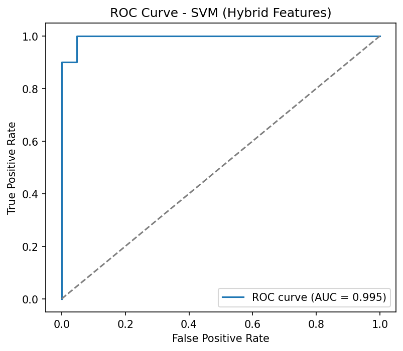

# 🧠 Multislice MRI Schizophrenia Classifier

This project is a **Streamlit-based web app** that predicts whether a brain MRI scan indicates **schizophrenia** or a **healthy control** using a **hybrid model**:

- **CNN features** extracted from MRI slices using EfficientNetB0
- **Classical image features** (GLCM, histogram, DWT)
- **LightGBM / SVM classifier** for final prediction  

---

## **Features**

- Upload `.nii` or `.nii.gz` MRI files
- Automatic extraction of multislice features (axial, coronal, sagittal)
- Combined deep + classical features for robust prediction
- Probability score and label output
- Lightweight Streamlit interface  

---

## **Demo Screenshot**

  

---

## **Getting Started**

### **1. Clone this repository**

```bash
git clone https://github.com/<your-username>/mri_classifier.git
cd mri_classifier
